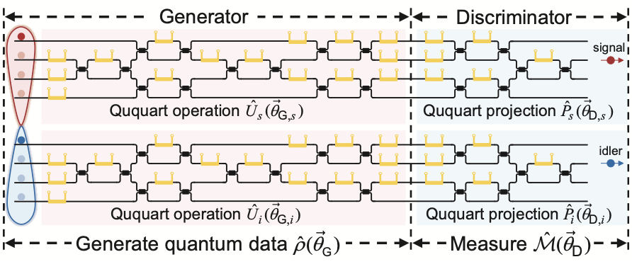

# Quandela iQuHACK 2024 In-Person Challenge

## Quantum generative adversarial learning in photonics

The goal of this challenge is to reproduce the results of [this paper](https://arxiv.org/abs/2310.00585) using Quandela's solution for quantum computation with linear optics called [__Perceval__](https://perceval.quandela.net). 

In the article, the authors implement a quantum adversarial generative model on a photonic circuit. The generator and the discriminator are directly connected to each other on the same chip: the generator's task is to prepare quantum states and the discriminator task is to be able to tell whether the state generated is the target state or not.

Generative adversarial networks (GANs) are a type of generative machine learning model. These attempt to learn the underlying distribution of the data in order to generate new samples. GANs are trained in an adversarial way against a discriminator (classifier). The discriminator alternatively receives real samples from the data and samples produced by the generator, and must classify them as real or fake. Consequently, as the discriminator becomes more performant, the generator must produce samples that are more and more convincing. More details on GANs can be found [here](https://developers.google.com/machine-learning/gan).

There are different ways of designing quantum versions of GANs, as proposed in [this paper](https://arxiv.org/abs/1804.09139) from 2018.

In this challenge, you will focus on the scenario where the generator and discriminator are both [quantum variational circuits](https://arxiv.org/abs/2012.09265), and the data consists of quantum states. 

### Objectives:
Your aim is to train a generator to produce the following state: $\frac{1}{2}(\ket{01} + \ket{12} +\ket{23} + \ket{30})$ from an input state which is the maximally entangled quqart $\frac{1}{2}(\ket{00} + \ket{11} +\ket{22} + \ket{33})$ using a QGAN photonic architecture. See again [this paper](https://arxiv.org/abs/2310.00585).

<p align="center">

</p>

1. Start by reproducing the circuit from Figure 1.d of the Wang et al. paper using Perceval.
2. Figure S1 contains the full circuit including the generation of the initial entangled states. You will notice that the authors generate the initial state using spontaneous four-wave mixing photon-pair sources which is not corresponding to Quandela's hardware. What alternatives can you come up with? Below are some hints of possible approaches (all valid) you could follow. You don't need to follow all the approaches of course. The first one (which is by far the easiest) is a good first solution.
 - use the Perceval class StateVector,
 - modify the scenario to work with (multipartite) qubit states and see if you obtain different results,
 - have a look at [this paper](https://arxiv.org/abs/2302.07357). Hint: start from another entangled state that is easier to produce and use the following Fock space unitary:

$$ U = \frac{1}{\sqrt{2}}\begin{pmatrix}
                        0 & 0 & 0 & 0 & 1 & 0 & 1 & 0 & \\
                        0 & 0 & 0 & 0 & 0 & 1 & 0 & 1 & \\
                        1 & 0 & 1 & 0 & 0 & 0 & 0 & 0 & \\
                        0 & 1 & 0 & 1 & 0 & 0 & 0 & 0 & \\
                        1 & 0 &-1 & 0 & 0 & 0 & 0 & 0 & \\
                        0 & 1 & 0 &-1 & 0 & 0 & 0 & 0 & \\
                        0 & 0 & 0 & 0 & 1 & 0 &-1 & 0 & \\
                        0 & 0 & 0 & 0 & 0 & 1 & 0 & -1 & \\
                        \end{pmatrix} $$ 
   
4. Once the circuit is ready, train the QGAN using a variational approach. You will notice that several technical details are omitted in the article, so you will have to explore various options and see what works. This applies to the gradient evaluation, the optimizer, hyperparameters etc.

The bonuses below are not ranked so you can choose to pick the one you prefer (or several of course).

__Bonus__: try to generate the state with more single photons by consuming some for heralding.

__Bonus__: can you add a noise model in Perceval? How does it affect your results?

__Bonus__: can you run this model directly on the [Ascella QPU](https://cloud.quandela.com)? If not, what adjustments would you need to make? If you have time, complete the challenge by running at least 1 evaluation of the model on Ascella.


---
Your mentors for this challenge will be Pierre-Emmanuel Emeriau and Samuel Horsch (on site) and Alexia Salavrakos (on Slack).

## How to use Perceval

### What is Perceval
Perceval is Quandela quantum simulation framework which **must** be used to answer this challenge

Perceval provides tools for composing circuits from linear optical components, defining single-photon sources, manipulating Fock states, running simulations, reproducing published experimental papers and experimenting with a new generation of quantum algorithms.

You can find documentation regarding Perceval here: https://perceval.quandela.net/docs/

And the source code repository is here: https://github.com/Quandela/Perceval

### Installation & Use
You have all the installation explanation on the github repository, we advise you to work on the version 0.10.3.

A lot of notebooks are available our github (in docs/source/notebooks) or in our documentation to inspire you.

If you have any issue, please contact either Marion Fabre (on site) or Eric Bertasi or Melvin Mathe (on Slack).

### What we expect
Create a GitHub repository, either add us (our usernames are in your github challenge repo) or send us the link (if it's public), and commit your code in this repository so we can keep track of your contribution. **Only** the code in the **main** branch will be reviewed and will be part of your evaluation.

The main branch of your git repository is required to follow at least this file architecture:
```
.
├── requirements.txt
├── README.md
```
- requirements.txt should contain all your scripts' python module dependencies, and follow the [requirements format](https://pip.pypa.io/en/stable/reference/requirements-file-format/)
- README.md explains how to use your repository and how you came up with this result(s)

Other files must be included in you git repository (such as python files or jupyter notebook, ...) and we must be able to reproduce every new graphs or results that you will show in your presentation

Good luck!
